# 项目简介
本项目为大学生心理辅导平台后端服务，基于 Spring Boot 构建， 提供用户管理、心理咨询预约、文章发布、心理测评等功能

# 技术栈
Spring Boot + MyBatis + Maven + MySQL + Redis
# 系统架构
系统采用经典三层架构：
> Controller 控制层（处理 HTTP 请求）
> Service 业务层（核心业务逻辑）
> Mapper/DAO 数据访问层（数据库操作）
## 结构
```bash
Application.java
│
├── controller ← 接口层
├── service ← 业务层
├── mapper ← 数据访问层
├── entity ← 数据模型
├── dto ← 组合查询模型
│
├── core ← 框架级支持（安全/缓存/异常）
│
├── filter ← JWT + Spring Security 过滤器
├── aspect ← AOP 日志
└── util ← 工具类
```
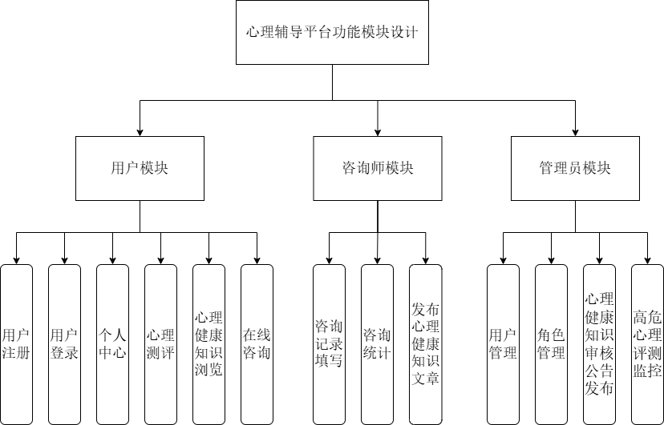
# 数据库设计
```bash
#ER 关系简图
account ──┬── account_role ── role ── role_permission ── permission
          │
          ├── user_test_record ── psychological_test ── psychological_question
          │
          └── consultation_session ── consultation_message
          
knowledge_category ── knowledge_article
```
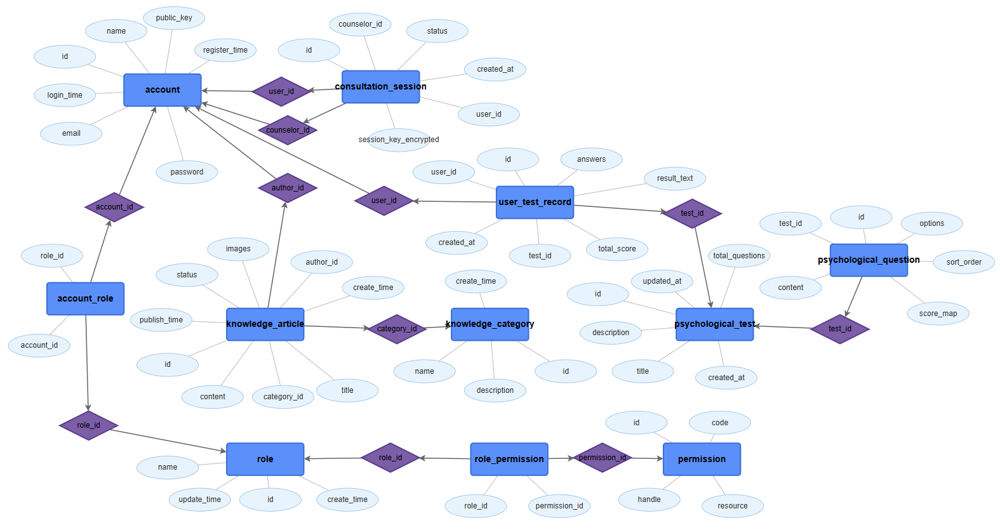
# 核心功能
## 用户模块（学生端）
- 用户注册 / 登录 支持手机号/邮箱注册，JWT 身份认证
  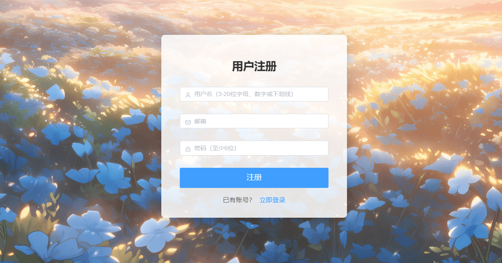
  
  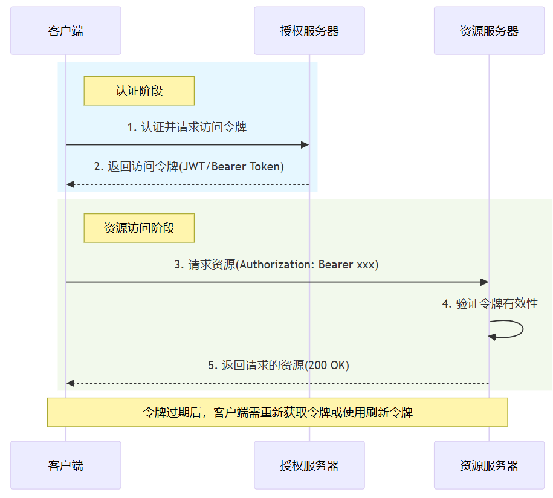
- 心理测评 在线完成标准化量表（如 SCL-90），自动生成结果解读
  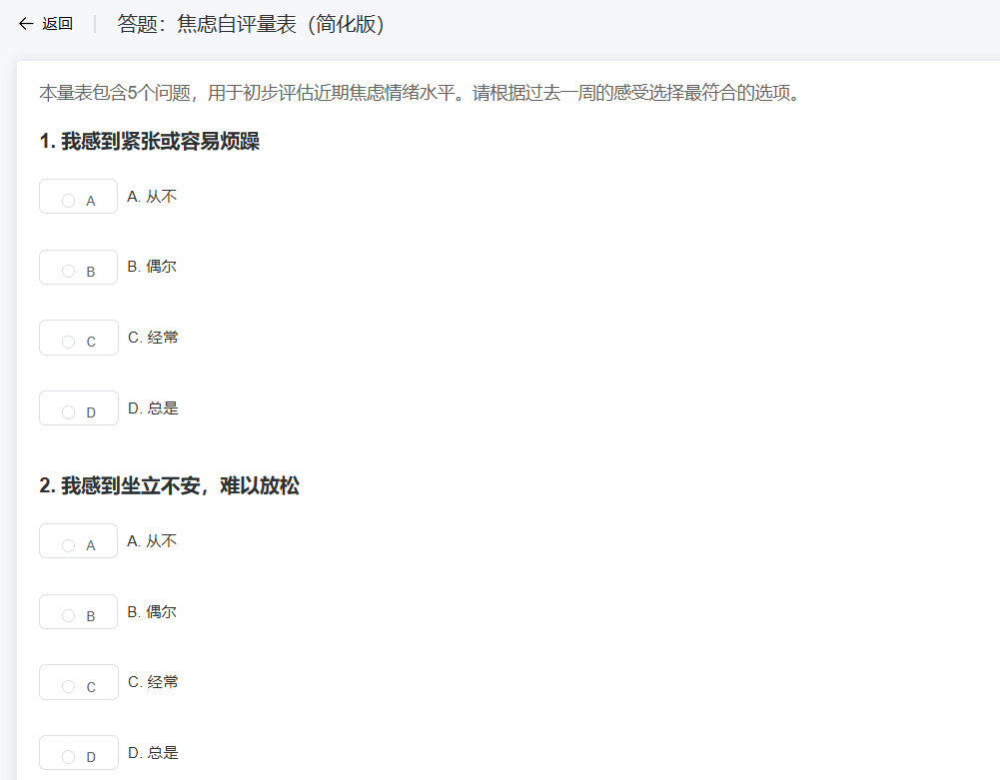
  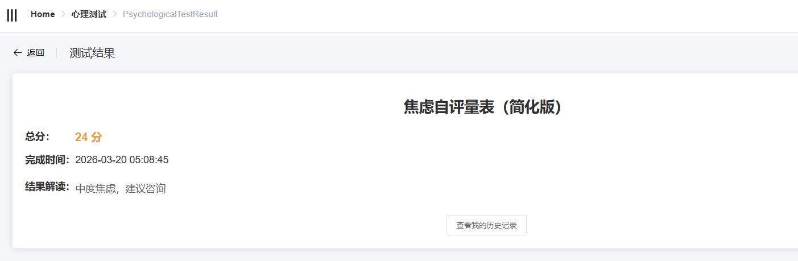
- 在线咨询 实时聊天咨询，消息端到端 AES 加密
  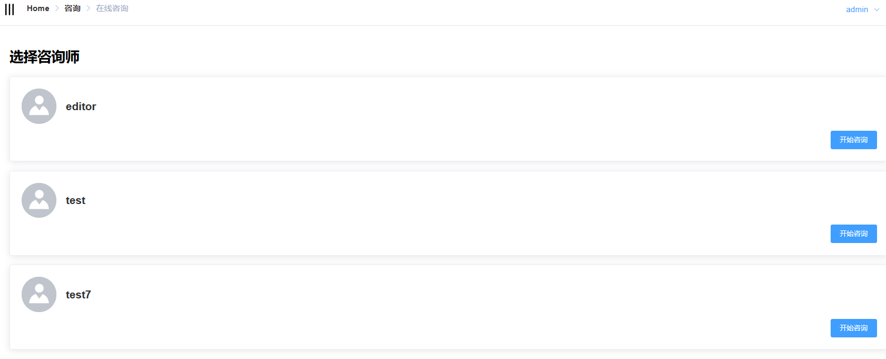
  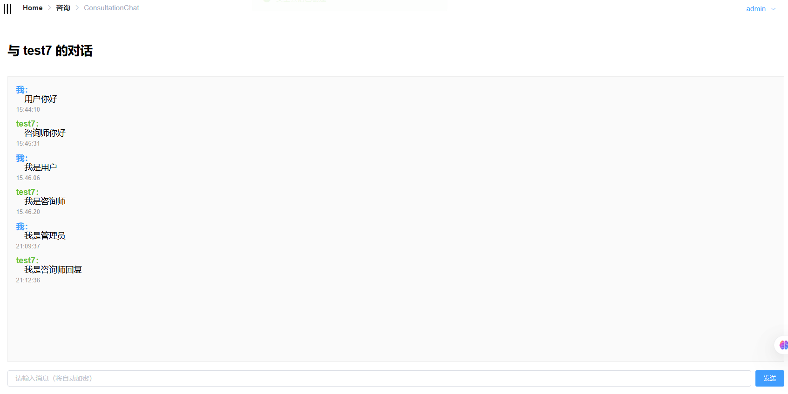
  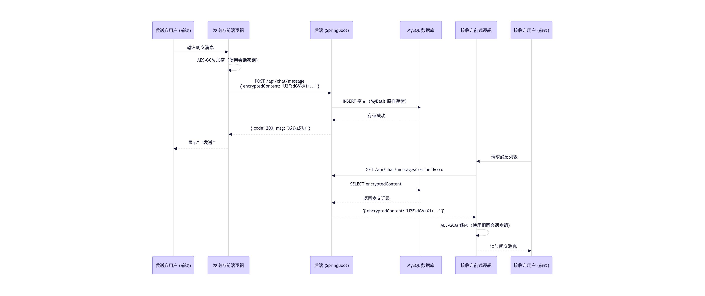
- 心理健康知识浏览 查阅分类知识库文章（情绪管理、人际关系等）
  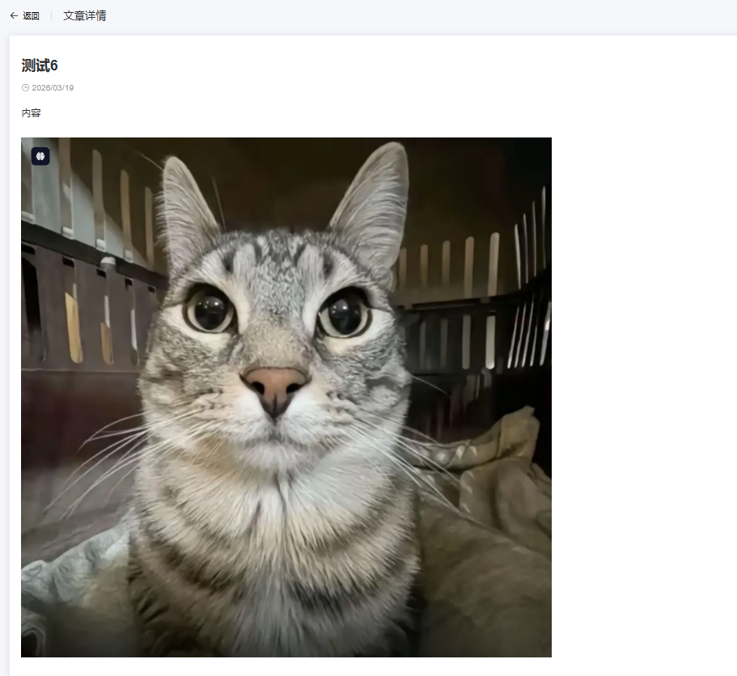
- 个人中心 查看测评记录、咨询历史、个人信息
  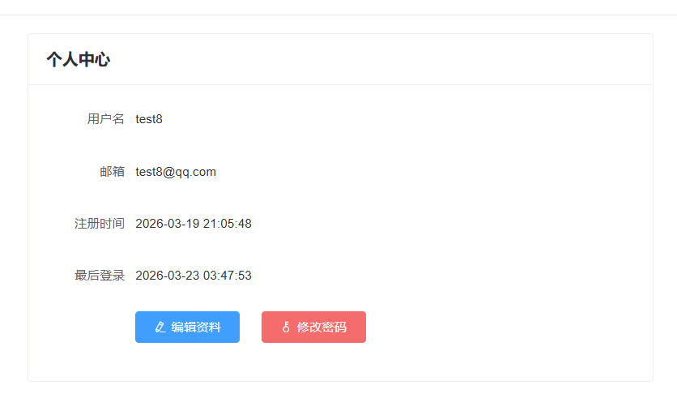
  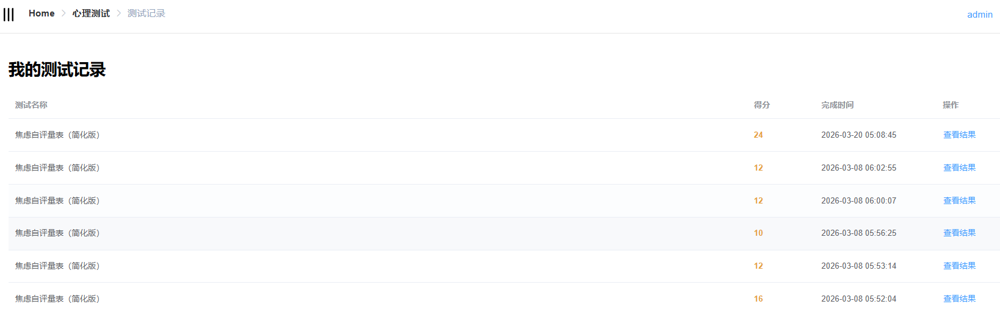
## 咨询师模块（专业端）
- 咨询记录填写 完整记录每次会话内容，支持富文本编辑
  
- 咨询统计 查看咨询次数、学生反馈、发布心理健康文章
  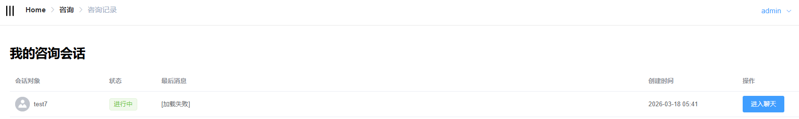
  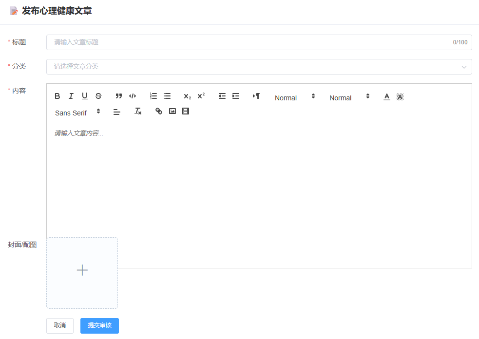
## 管理员模块（后台）
-  用户管理 查看/禁用用户账号，处理异常行为
  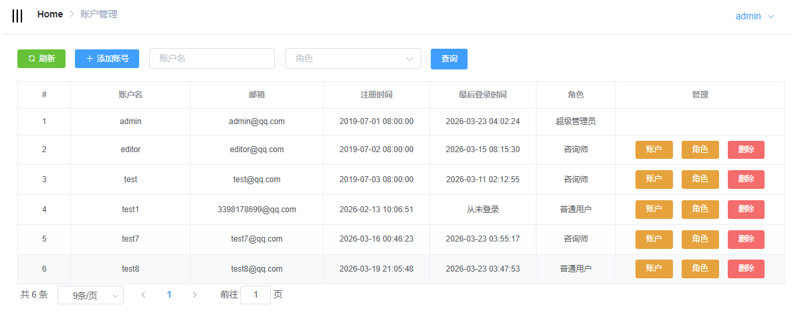
- 咨询师管理 审核、分配、监控咨询师资质与工作状态系统公告发布 向全体用户推送重要通知
  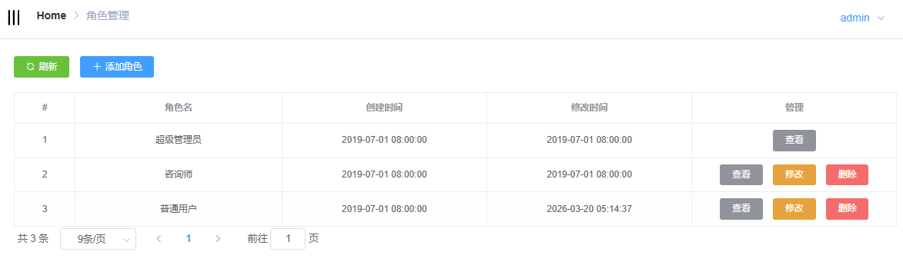
  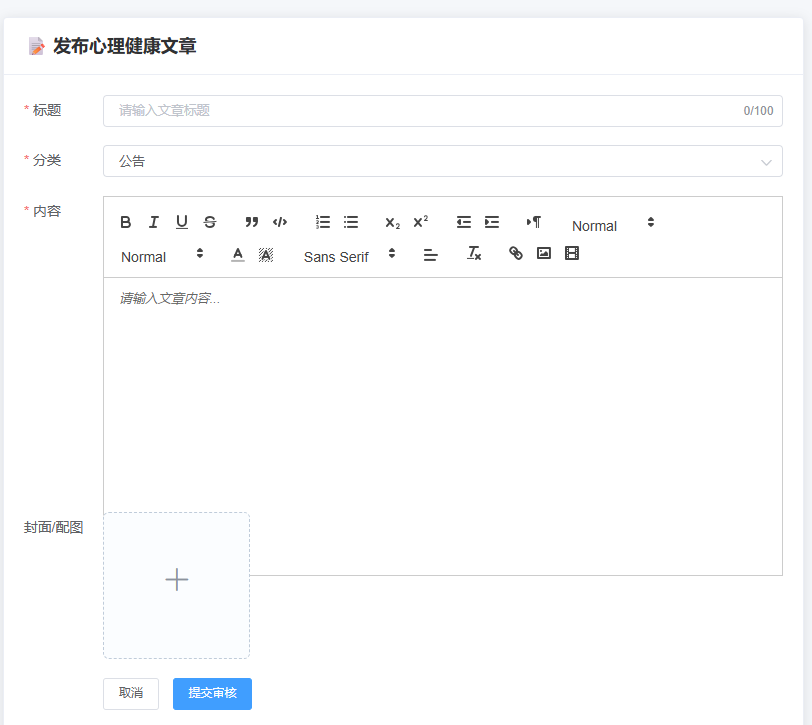
- 敏感数据监控 实时监控高风险行为并告警
  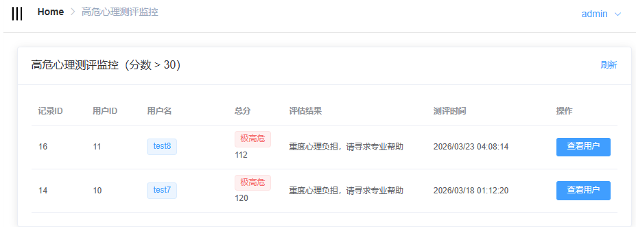
  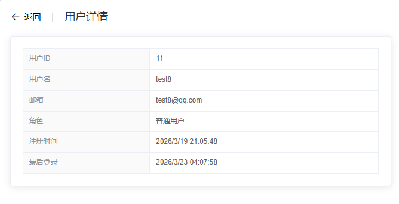
